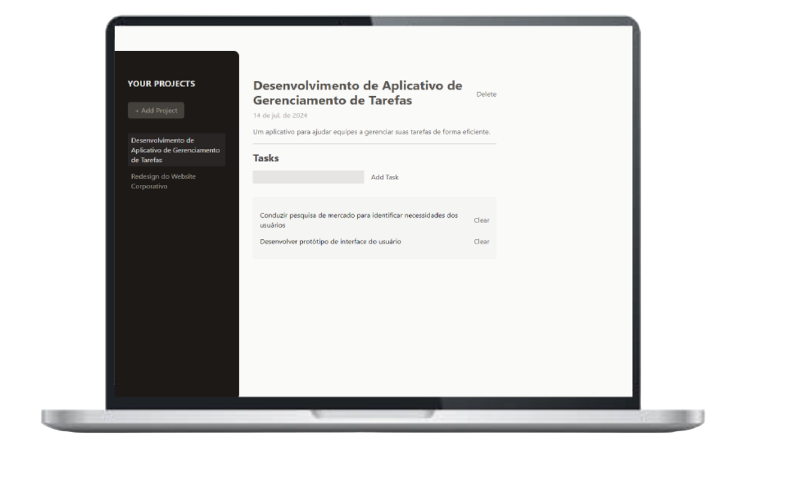

<h1 align="center">
  Project Management
</h1>

  

## ✨ Tecnologias

Esse projeto foi desenvolvido com as seguintes tecnologias:

- [React](https://react.dev)
- [CSS](https://developer.mozilla.org/pt-BR/docs/Web/CSS)
- [JavaScript](https://developer.mozilla.org/pt-BR/docs/Web/JavaScript)
- [Vite](https://vitejs.dev)

## 💻 Projeto

O Project Management é um app que permite adicionar projetos e tarefas, funcionando como um To-Do list, mas de forma simplificada.

## 🔖 Acesso

[Project Management](https://project-management-0.netlify.app)

## 🚀 Como executar

- Clone o repositório
- Instale as dependências com `npm install`
- Inicie o servidor com `npm run dev`

Agora você pode acessar [`localhost:5173`](http://localhost:5173) do seu navegador.

---
